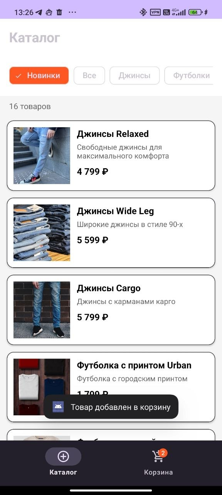
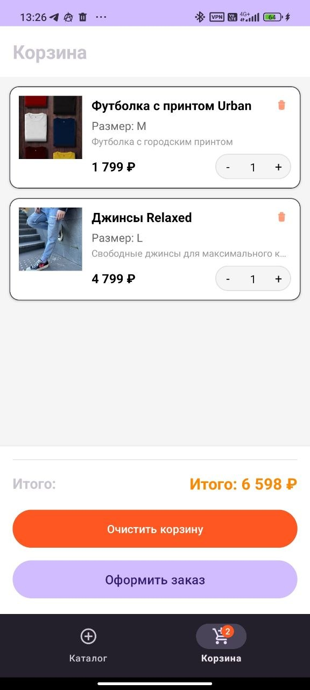
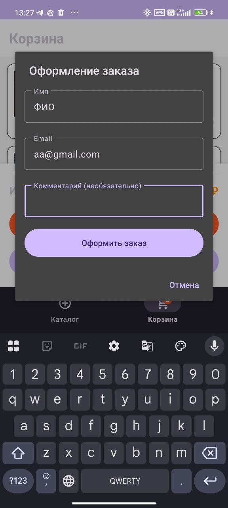
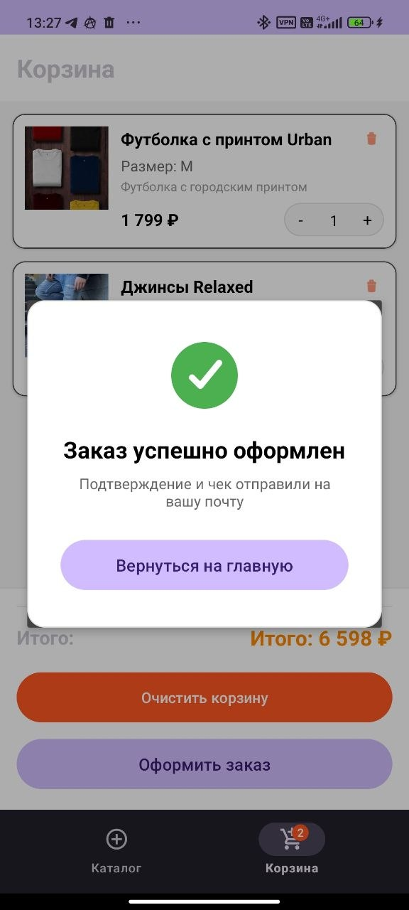
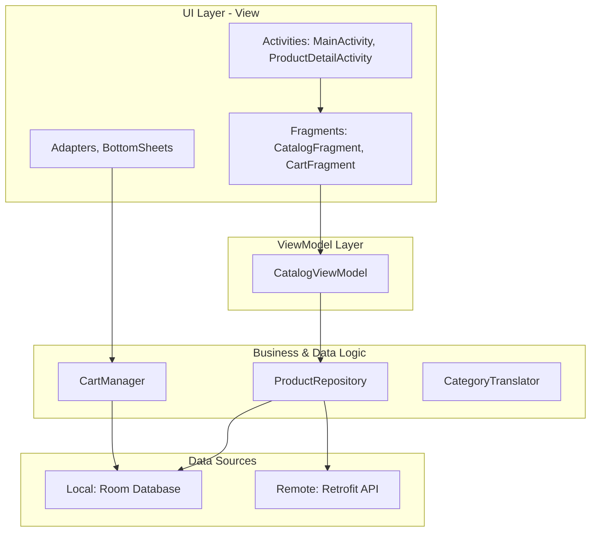

# team-still-lonely

Студенческий проект: team-still-lonely

Платформа: Android  
Язык: Kotlin  
Сборка: Gradle Kotlin DSL  

## Команда

- Кравцов Дмитрий Константинович — разработчик
- Студенихин Егор Алексеевич — разработчик
- Задворный Антон Сергеевич — разработчик

## Описание приложения

Android-приложение интернет-магазина. Проект взят за основу из прошлого семестра и будет дорабатываться в рамках курса мобильной разработки.

## Инструкция по сборке

### Требования
*   **Android SDK**: API 34+
*   **JDK**: Version 17 (рекомендуется)
*   **Gradle**: 8.0+ (используется Gradle Wrapper)

### Сборка
Для сборки проекта выполните команду в терминале:
```bash
./gradlew assembleDebug
```
После успешного завершения APK-файл будет доступен в папке `app/build/outputs/apk/debug/`.

## Скриншоты

### Каталог


### Детали товара


### Корзина


### Пустая корзина


### Оформление заказа


### Заказ успешно оформлен


## Реализованный функционал

- Базовая структура Android-приложения
- Экраны приложения
- Навигация между экранами
- Работа с товарами / карточками / интерфейсом магазина

### HW2: Каталог

- Загрузка товаров из `res/raw/products.json` через `ProductRepository`
- Экран каталога с табами категорий (включая «Новинки» по тегу `New`)
- Карточки товаров с изображением, названием и ценой в рублях (`PriceFormatter`)
- Состояния загрузки (ProgressBar) и ошибки с кнопкой «Повторить»
- Нижнее меню: каталог и корзина
- Сохранение выбранной категории при повороте экрана и убийстве процесса

**Затронутые модули:** `data/` (`ProductRepository`, модели), `ui/catalog/`, `utils/PriceFormatter`, `res/raw/products.json`

**Как проверить:** запустить приложение → открыть каталог → переключить категории → повернуть экран → убить процесс и открыть снова.

### HW3: Детали товара

- Bottom sheet с деталями товара при тапе на карточку в каталоге (`ProductBottomSheet`)
- Отображение изображения, названия, описания, цены, тегов (чипы) и выбора размера
- Кнопка (i) — диалог с характеристиками: материал, вес, сезон, страна производства
- Кнопка «В корзину» с выбором размера
- Закрытие: свайп вниз, крестик, тап по затемнению
- Бейдж «NEW» на карточках новинок в каталоге

**Затронутые модули:** `ui/catalog/ProductBottomSheet.kt`, `res/layout/bottom_sheet_product_detail.xml`, `CatalogFragment`, `item_product.xml`

**Как проверить:** каталог → тап по товару → выбрать размер → «В корзину» → кнопка (i) → закрыть bottom sheet.

### HW4: API и оффлайн

- Загрузка каталога из API (`GET /catalog`) через Retrofit и `ProductRepository`
- Кэширование каталога в Room (`AppDatabase`, `ProductDao`, `CategoryDao`)
- Стратегия cache-first: сначала кэш, затем обновление из API
- Snackbar «Нет подключения к интернету» при отсутствии сети
- Состояния загрузки и ошибки с кнопкой «Повторить» (если кэш пуст)

**Затронутые модули:** `data/ProductRepository.kt`, `data/local/`, `data/remote/`, `utils/NetworkMonitor.kt`, `ui/catalog/CatalogViewModel.kt`, `ui/catalog/CatalogFragment.kt`

**Как проверить:** запустить с интернетом → дождаться загрузки каталога → отключить сеть → перезапустить приложение (каталог из кэша, snackbar «Нет сети») → включить сеть → «Повторить» в snackbar.

### HW5: Корзина и заказы

- Добавление в корзину из `ProductBottomSheet` с выбранным размером
- Корзина в Room (`CartEntity`, `CartDao`) — только productId, sizeName, quantity
- Отображение корзины собирается из каталога и данных БД (`CartManager`)
- Бейдж на иконке корзины в нижней навигации
- Экран корзины: список, +/- количество, удаление, итог, empty state
- Очистка корзины с подтверждением
- Оформление заказа: имя, email, комментарий, валидация, диалог успеха

**Затронутые модули:** `data/CartManager.kt`, `data/local/` (CartEntity, CartDao), `ui/productdetail/CartFragment.kt`, `CartAdapter.kt`, `MainActivity.kt`, `ProductBottomSheet.kt`

**Как проверить:** каталог → товар → размер → «В корзину» → вкладка «Корзина» → изменить количество → «Оформить заказ» → заполнить имя и email → подтвердить.

### HW6: Качество кода и тестирование

- Настроен `ktlint` для всего проекта (плагин `org.jlleitschuh.gradle.ktlint`)
- Проведен рефакторинг существующего кода для соответствия Kotlin Style Guide
- Исправлены нарушения стиля: именование, импорты, отступы и завершающие запятые
- Реализовано более 5 Unit-тестов на JUnit 4 для проверки бизнес-логики:
    - `PriceFormatterTest`: форматирование и округление цен
    - `CategoryTranslatorTest`: логика перевода и поиска категорий
    - `ProductBusinessLogicTest`: вычисляемые свойства модели товара
    - `CartBusinessLogicTest`: расчет стоимости корзины
    - `ModelMappingTest`: корректность маппинга Room-сущностей в доменные модели

**Затронутые модули:** весь проект, `build.gradle.kts`, `gradle/libs.versions.toml`, `app/src/test/`.

**Как проверить:**
- `./gradlew ktlintCheck` — проверка стиля кода.
- `./gradlew ktlintFormat` — автоматическое исправление стиля.
- `./gradlew test` — запуск Unit-тестов.

## Архитектура

Проект реализован на основе архитектурного паттерна **MVVM** с использованием **Repository** для управления источниками данных.



### Описание архитектуры

1.  **UI Layer:** Состоит из Activity и Fragment, которые отвечают за отображение данных и взаимодействие с пользователем.
2.  **ViewModel:** Выступает посредником между UI и логикой данных, храня состояние экрана в `LiveData` и обеспечивая его сохранение при конфигурационных изменениях.
3.  **Repository (ProductRepository):** Реализует стратегию "Single Source of Truth". При получении каталога сначала возвращает закэшированные данные из Room, а затем обновляет их через API.
4.  **CartManager:** Специализированный компонент для управления корзиной, объединяющий данные из базы данных с информацией о товарах из каталога.
5.  **Data Sources:** Инкапсулируют работу с сетевым клиентом (Retrofit) и локальной базой данных (Room), скрывая детали реализации от бизнес-логики.
6.  **Domain Models:** Объекты `Product`, `Category` и `CartItem` используются во всем приложении как единые модели данных, преобразованные из технических сущностей БД или API.

## Текущее состояние

Проект перенесён в новый репозиторий. Реализованы каталог (HW2), детали товара (HW3), API с оффлайн-режимом (HW4), корзина с оформлением заказа (HW5) и настроен статический анализ кода (HW6).
